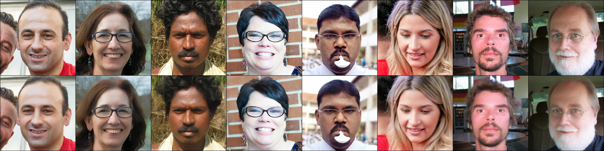
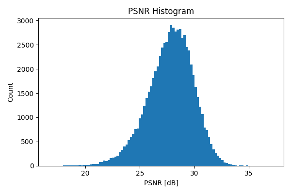
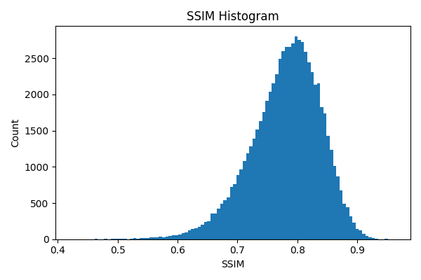
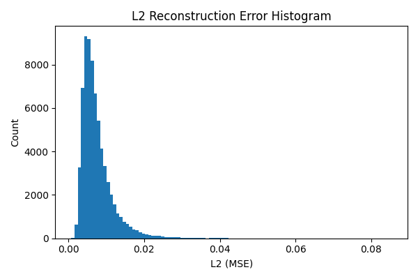

# FFHQ SQ-VAE Latent (1024) + D3PM

Experimental implementation of **SQ-VAE** (Sony's VQ-VAE derivative) combined with a **Discrete Diffusion Probabilistic Model (D3PM)** to generate face images from highly compressed discrete latent representations on FFHQ.

本プロジェクトは、**論文からの自力実装による技術力の証明および研究実装の再現性確認**を目的として作成しました。

---

## Generated Samples

16 faces generated by D3PM in the SQ-VAE latent space (1000 denoising steps):


---

## SQ-VAE Reconstruction Quality

8 pairs of **original (top row) vs reconstructed (bottom row)** after decoding from 64×64 discrete latents (codebook size 1024):



The reconstruction remains visually faithful even though each image is encoded into only 4,096 discrete tokens.

### Quantitative Evaluation

| Metric | Distribution |
| --- | --- |
| PSNR |  |
| SSIM |  |
| L2 Loss |  |

See [`sqvae_eval_results/reconstruction_stats.txt`](sqvae_eval_results/reconstruction_stats.txt) for the full statistics summary.

---

## Overview

本実装では以下の構成を採用しています。

- **Encoder / Decoder**: SQ-VAE (Sony の VQ-VAE 派生論文)
- **Latent Space**: 離散潜在表現（1024 codebook、64×64 grid）
- **Generative Model**: Discrete Diffusion Probabilistic Model (D3PM)
- **Dataset**: FFHQ（512×512 顔画像）

SQ-VAE によって得られた離散潜在表現を用いて D3PM を訓練し、最終的に **顔画像を生成可能なモデル** を構築しました。

---

## Motivation

### なぜ SQ-VAE を選択したか

SQ-VAE は Sony の VQ-VAE 系研究の中で、

- **特定のコードブックだけ使わずにたくさんのコードを使う**

という特徴を持ちます。

本実験では、

- 画像を **JPEG 比で約 1/400** まで圧縮
- それにも関わらず顔画像としての視覚的品質を維持（PSNR ~28 dB）

できることを確認しました。

これは **生成モデルの学習対象を大幅に単純化できる** 可能性を示します。

### なぜ D3PM を選択したか

D3PM を選定した理由は以下です。

- SQ-VAE の出力は **離散潜在表現**
- 連続潜在表現よりも **情報量が少ない**
- ⇒ **モデル容量を削減できるのではないか** と仮説を立てた

この仮説を検証するため、連続潜在ではなく **離散拡散モデル (D3PM)** を用いた生成を試みました。

---

## Results

- SQ-VAE により **高圧縮かつ高品質な潜在表現** の生成に成功（PSNR ~28 dB、JPEG 比 ~1/400）
- D3PM により、潜在空間上での拡散生成が可能（上記 16 枚参照）
- 潜在からのデコードによって **顔画像生成を確認**

一方で、

- **離散潜在表現を用いても、期待したほどモデルサイズの削減はできなかった**

という結果も得られました。

---

## Discussion

本実験から得られた知見は以下です。

- 離散潜在表現は **情報圧縮として非常に有効**
- しかし、**離散化 = モデル軽量化** という単純な関係にはならない
- モデルサイズや計算量は以下に強く依存する:
  - 潜在の次元
  - 拡散ステップ数
  - カテゴリ数

この結果は、**「潜在表現の情報量」と「生成モデルの複雑さ」は独立に評価すべき** であることを示唆しています。

---

## Repository Structure

```
├── ffhq_sq_vae.py                      # SQ-VAE model definition
├── encode_sqvae_latents.py             # Encode FFHQ into discrete latents
├── eval_sqvae_ffhq.py                  # SQ-VAE reconstruction evaluation
├── eval_sqvae_from_latents.py          # Latent-based evaluation
├── train_d3pm_latent_cross_mi_mask.py  # D3PM training on latent space
├── grid_4x4_steps1000.png              # D3PM generation sample
├── sqvae_results_ffhq_1024/            # SQ-VAE reconstruction samples (per epoch)
└── sqvae_eval_results/                 # Evaluation histograms and statistics
```

---

## Compute

- Tokyo Institute of Technology **TSUBAME supercomputer** (free H100 quota)
- **Lambda Labs H100** (self-funded)

---

## Purpose of This Repository

- 最新研究（SQ-VAE / D3PM）の理解と論文からの再実装
- 圧縮 × 生成の設計トレードオフの検証
- **研究・実装能力のポートフォリオとしての提示**

---

## References

- Sony AI — SQ-VAE (2022)
- Google Research — D3PM (2021)
- FFHQ dataset — NVIDIA StyleGAN
